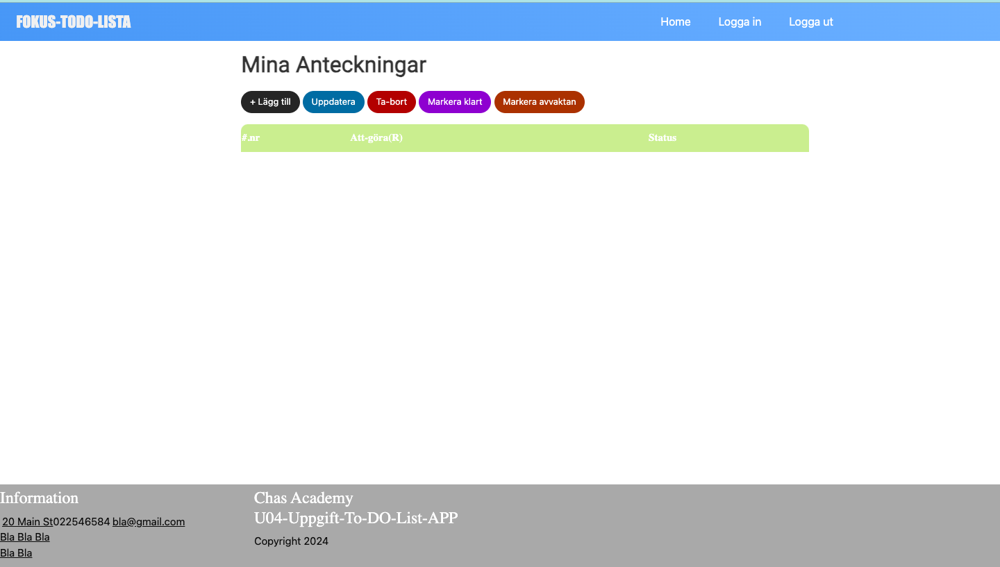
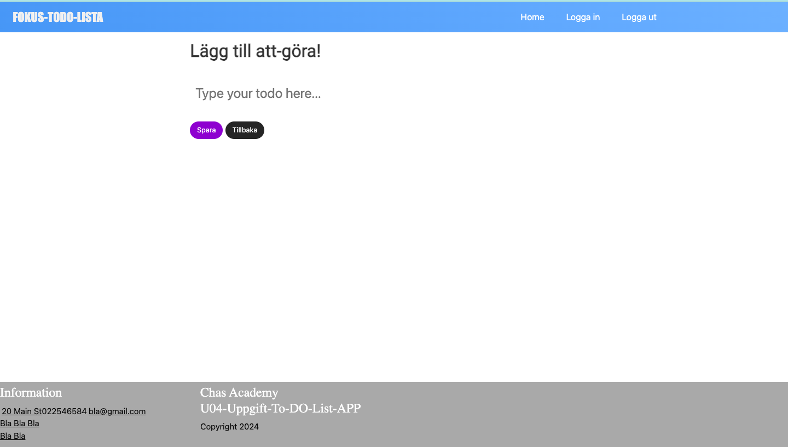
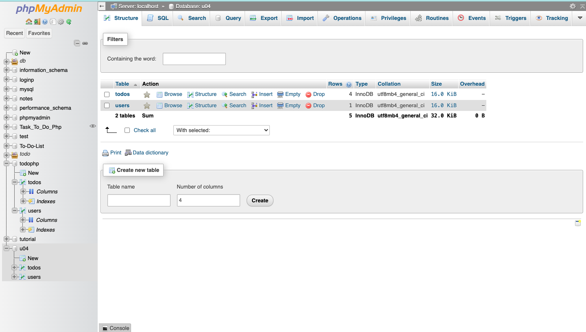
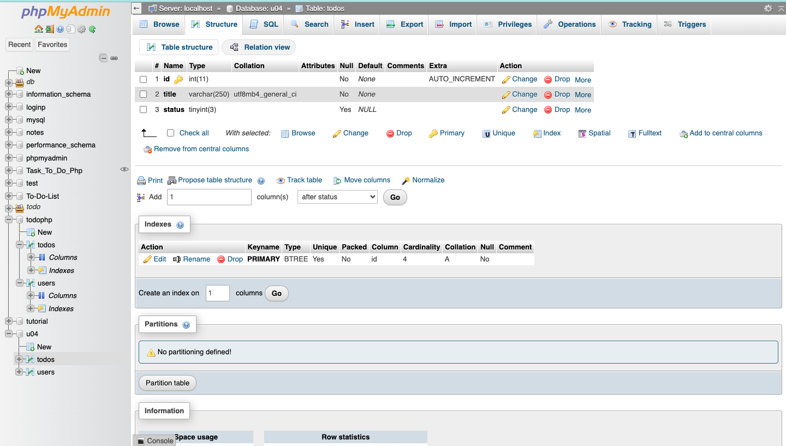
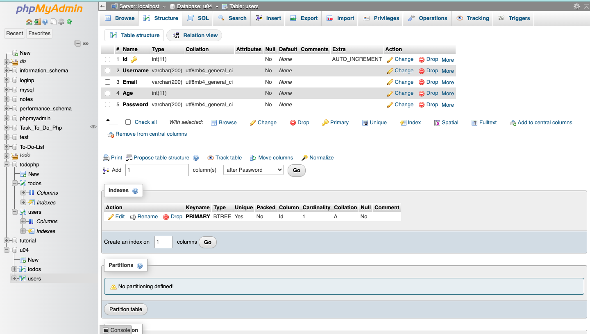
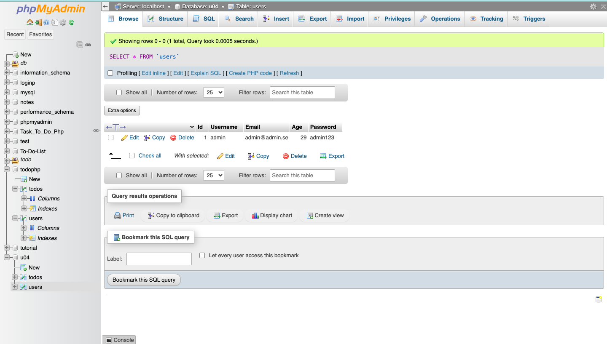
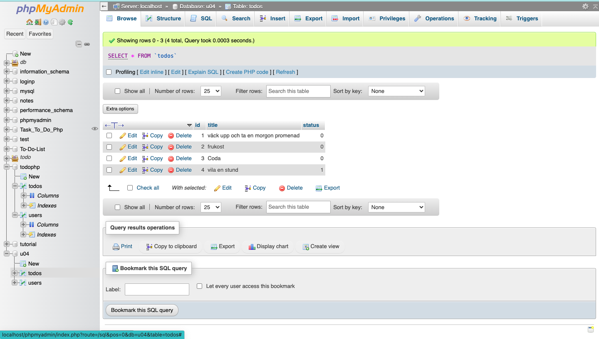

## U04 To-Do Lists App med PHP and Mysql

Ett webbprojekt som är en att-göra-lista heter FOKUS-TODO-LISTA där listan sparas och läses in från en databas. Databasen visar upp hur CRUD går till på er applikation (hur man kan lägga till, en todo/uppgift, hur man kan markera den som klar, 

---

---

om man har andra uppdateringsfunktionalitet, hur man kan ta bort och hur man kan se alla todos).

I detta moment kommer man se hur man kan skapa en digital att-göra-lista app i en dynamisk webbplats, med PHP, SQL HTML och CSS. Den här uppgiften går ut på att i bygga en webbplats som nyttjar en databas i PHP och Sql.

---

---

PHP, HTML och CSS med koppling till en SQL-databas med 2 tabeller för uppgifter (tasks). Varje uppgift har ett unikt id,
en titel, en uppgiftstext, färdigmarkering (om uppgiften är klar).  Användaren kan kunna hantera och visa alla uppgifter, lägga till en uppgift, ändra en uppgift, ta bort en uppgift och markera en uppgift som klar eller avvaktar.

---

---

Alla ändringar ska sparas i databasen

---

---

Webbplatsen har ett HTML-formulär som med hjälp av PHP kan hantera uppgifterna och uppdateringen av dem. Den har också funktionalitet för att ta bort alla färdigmarkerade uppgifter från listan.

Det går också att skapa ett nytt kontot att registrera sig och logga in på sidan. Eller logga in med en "demo-konto". 

---

---

En SQL databas med 2 tabeller (todos och users) och data Hantera uppgifter, Skapa (Create), Läsa (Read), Uppdatera (Update) (innebär alltså att uppgiftens information ska gå att ändras), Ta bort (Delete), Markera uppgift som är klar.

En kort presentation om Fokus-ToDo-Lista app 

[Presentation U04](https://drive.google.com/file/d/124sKpj29STA_2TFM55ZnXgefHxv8xKv9/view)

Alla Fokus-To-Do-Lista codes i .zip
[ladda ned codes ](https://drive.google.com/file/d/1be8rr7UpZxlkX3UqYOGI_JMn_YsJt6Tc/view)

---
